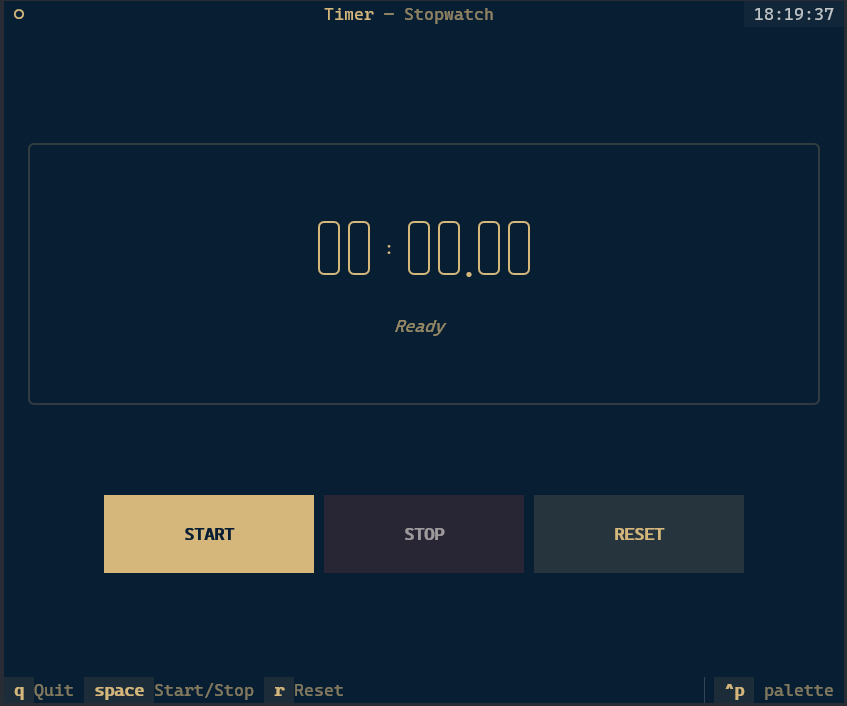

# Chronox

A powerful and visually stunning terminal-based timer application built with [Textual](https://textual.textualize.io/) and [Typer](https://typer.tiangolo.com/).

- **TUI Interface**: Beautiful, responsive terminal user interface with a premium feel.
- **CLI Interface**: Lightweight mode (no Textual UI) via `--cli`.
- **Notifications**: Visual and audio feedback (bell) when a countdown completes.



## Features

- **Stopwatch**: Precise stopwatch with centisecond resolution.
- **Countdown**: Configurable countdown timer with support for seconds, minutes, and hours.

## Installation

- Requires **Python 3.13+**
- Installs two commands: `clk` (recommended) and `chronox`

From PyPI:

```bash
pip install chronox
```

If you use uv:

```bash
uv tool install chronox

# or (inside a project)
uv add chronox
```

## Usage

Chronox provides two command names for convenience:

- `clk` - Short and convenient alias
- `chronox` - Full command name

Both commands work identically. Examples:

```bash
clk sw         # or: chronox sw
clk cd 5 m     # or: chronox cd 5 m
```

### Stopwatch

Start a stopwatch to track elapsed time:

```bash
clk sw
```

For CLI mode (no Textual UI):

```bash
clk sw --cli
```

**Controls (TUI mode):**
- `Space`: Start/Stop
- `r`: Reset
- `q`: Quit

### Countdown Timer

Start a countdown for a specific duration:

```bash
clk cd 5 m    # 5 minutes
clk cd 60 s   # 60 seconds
clk cd 1 h    # 1 hour
```

For CLI mode (no Textual UI):

```bash
clk cd 5 m --cli
```

**Controls (TUI mode):**
- `Space`: Pause/Resume
- `q`: Quit

## Development

### Prerequisites

- [uv](https://github.com/astral-sh/uv) installed on your system.
- Python 3.13+

### Installation for Development

To install in editable mode for development:

```bash
make local
```

### Global Installation (Recommended for Testing)

To install as a system-wide utility:

```bash
make global
```

This builds a standalone executable and copies it to `/usr/local/bin/termclock`, and also creates a `/usr/local/bin/clk` symlink.

### Make Commands

| Command                | Description                                       |
| ---------------------- | ------------------------------------------------- |
| `make local`           | Install in editable mode for development          |
| `make global`          | Build and install system-wide to `/usr/local/bin` |
| `make build`           | Build standalone executable (with version bump)   |
| `make bump`            | Bump patch version (default)                      |
| `TYPE=MINOR make bump` | Bump minor version                                |
| `TYPE=MAJOR make bump` | Bump major version                                |
| `make clean`           | Remove build artifacts                            |
| `make uninstall`       | Remove global installation                        |

### Project Structure

```
chronox/
├── src/
│   ├── app.py              # CLI entry point using Typer
│   ├── cli/
│   │   ├── __init__.py     # CLI package exports
│   │   └── cli.py          # CLI implementations for timers
│   ├── core/
│   │   ├── formatting.py   # Time formatting utilities
│   │   └── termclock.py    # Core timer logic
│   └── tui/
│       ├── __init__.py     # TUI package exports
│       ├── countdown.py    # Countdown TUI
│       ├── stopwatch.py    # Stopwatch TUI
│       └── theme.tcss      # Textual CSS theme
├── scripts/
│   └── bump.sh             # Version bump script
├── pyproject.toml          # Project configuration
├── termclock.spec          # PyInstaller specification
├── uv.lock                 # Dependency lock file
├── Makefile                # Build and install commands
├── LICENSE                 # Project license
└── README.md               # This file
```

### Publishing to PyPI

#### Test PyPI

To publish to Test PyPI:

```bash
make build
uv build
uv publish --index testpypi
```

#### Production PyPI

To publish to production PyPI:

```bash
make build
uv build
uv publish
```

### Uninstallation

To remove the global installation:

```bash
make uninstall
```
